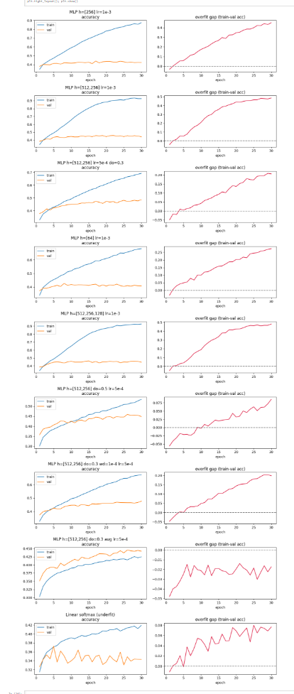
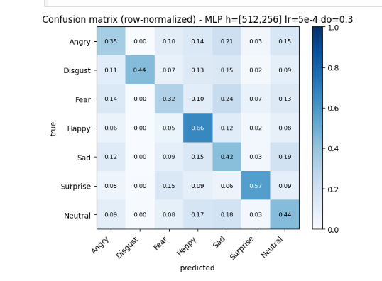
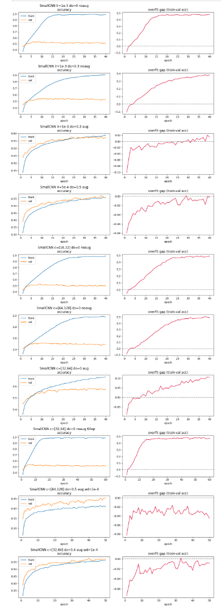
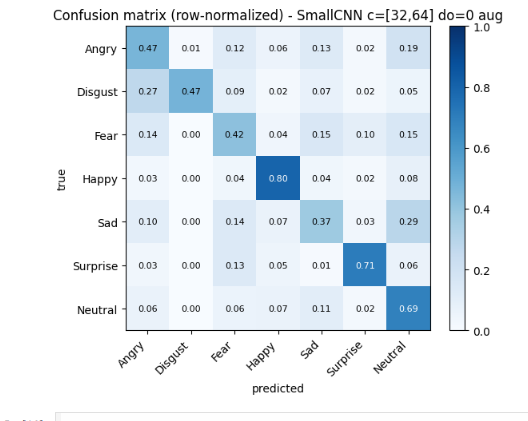
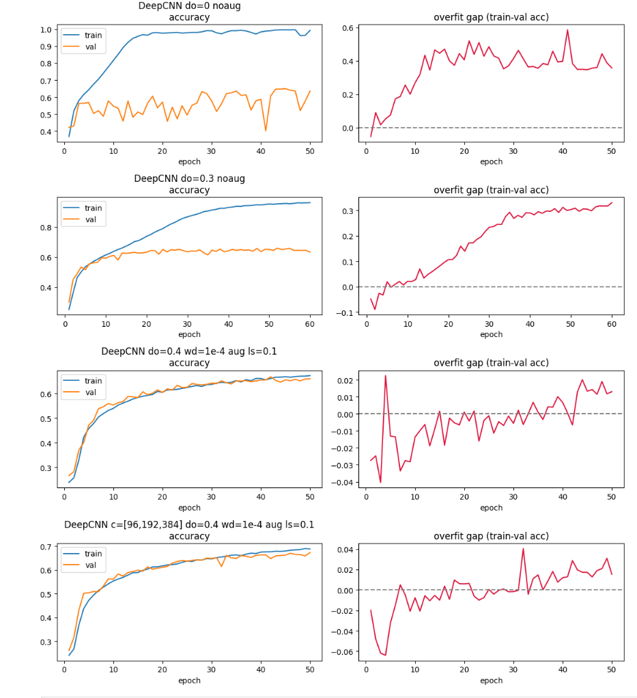
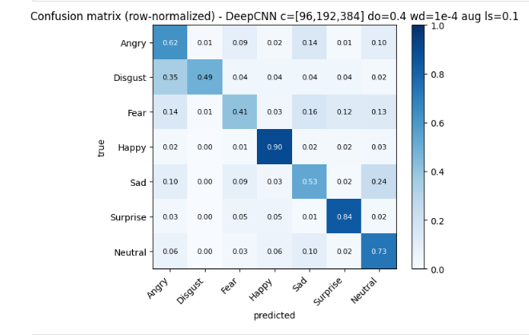

# Facial Expression Recognition (FER-2013) — Neural Networks + Weights & Biases


**W&B project:** https://wandb.ai/rkvit23-free-university-of-tbilisi-/fer2013-emotion


---

## 1. Competition overview

48x48 სახის ფოტოები, თითოეულს ლაბელი აქვს 7 ემოციიდან. მულტი კლას კლასიფიკაცია გვაქვს, რომელიც ისქორება ექურასის მიხედვით. დატა უკვე გასპლიტულია.


## 2. Repository structure

```
README.md                        # ანალიზი
WANDB_REPORT.pdf                  # რეპორტი (link მაქვს ქვევით რიდმიში)
model_experiment_MLP.ipynb       # iteration 1 — MLP
model_experiment_SmallCNN.ipynb  # iteration 2 — Small CNN (+ W&B sweep)
model_experiment_DeepCNN.ipynb   # iteration 3 — Deep CNN (+ W&B sweep)
submission.csv                   # საბმიშენის ფაილი
pictures/                        # რიდმიში გამოყეენბული ფოტოები
```


მოდელის შემოწმება: თითოეული მოდელის დატრენინგებამდე ვუშვებთ sanity checkს
forward დროებითი ბატჩი შემოგვაქვს რომელმაც (B,7) სასრული ზომის მატრიცა უნდა დააგენერიროს
ინიტიალიიზაციისას ლოსი - რანდომ ინიციალიზაციამ ქროს ენტროპი უნდა მოგვცეს დაახლოებიტ ln7 ველიუსი
backward ერთი loss.backward() ის შემდეგ, ყოველი დატრენინგებადი პარმეტრი უნდა იღებდეს სასრული არა-null გრადიენტს.


### Iteration 1 — MLP (baseline, `MLP_Training`)


დავიწყეთ ყველაზე მარტივი ნეთვორქით - 48x48 ფოტო დაგვყავს ვექტორზე და ვიყენებთ დიდ ლეიერებს. ამას ვაკეთებთ იმის შესამოწმებლად თუ რა შეუძლია ბეისლაინ მოდელს. ვიღებთ 9 სხვადასხვა კონფიგურაციას რეგულარიზაციის სვიპს, წრფივ ბეისლაინს. 

| Run | Params | Train acc | Val acc | Test acc | Test F1 | Final gap | Verdict |
|-----|--------|-----------|---------|----------|---------|-----------|---------|
| Linear softmax | 16k | 0.419 | 0.373 | 0.364 | 0.289 | 0.08 | **underfit** |
| h=[64] | 148k | 0.683 | 0.427 | 0.422 | 0.378 | 0.27 | mild overfit |
| h=[256] | 592k | 0.874 | 0.440 | 0.441 | 0.439 | 0.45 | overfit |
| h=[512,256] | 1.31M | 0.927 | 0.458 | 0.456 | 0.452 | 0.49 | **strong overfit** |
| h=[512,256,128] | 1.35M | 0.927 | 0.463 | 0.452 | 0.445 | 0.48 | strong overfit |
| h=[512,256] do=0.5 | 1.31M | 0.534 | 0.459 | 0.454 | 0.419 | 0.09 | over-regularized |
| h=[512,256] do=0.3 +wd | 1.31M | 0.675 | 0.477 | 0.468 | 0.453 | 0.20 | good (for an MLP) |
| h=[512,256] do=0.3 +aug | 1.31M | 0.425 | 0.446 | 0.444 | 0.359 | −0.02 | aug *hurts* |
| **h=[512,256] do=0.3 (lr 5e-4)** | 1.31M | 0.692 | **0.486** | **0.476** | **0.476** | 0.21 | **best MLP** |


  Capacity ladder: ქსელი იზრდება (წრფივი - 64-256-[512, 256]), ტრეინის ექურასი იზრდება 0.42 - 0.93 მაგრამ ვალიდაცია შედარებით იგივე რჩება და გეპი ხდება ძალიან დიდი. პიქსელ მლპს აქვს ძალიან დაბალი გენერალიზაცია. ზედმეტი capacity კი უბრალოდ ოვერფიტს მოგვცემს. არ შეუძლია წონების გაზიარება, არ აქვს ლოკალურობა, არც ტრეინის დატაზე შეუძლია ფიტი (მაღალი ბაიასი აქვს).
  ანდერფიტი (წრფივი) ტრეინის ექურასი არის 0.42 და ვალიდაცია 0.37 ისინი ორივე ძალიან დაბალია და გეპიც არაა დიდი - მიზეზი ისევ წეღან დასახელებული მაღალი ბაიასია.
  ოვერფიტი (h = [512,256], რეგულარიზაციის გარეშე) ტრეინი 0.93 ვალიდაცია 0.46. გეპი არის 0.49 და ვალიდაციის ლოსი იზრდება 10 epoch ის შემდეგ. მაღალი ოვერფიტია
  რეგულარიზაცია: დროპაუტი 0.3 გადმოდგა ყველაზე კარგი, ვალიდაცია იყო 0.486. 0.5 ზედმეტად ბევრი იყო, იმის მიუხედავად რომ გეპი 0.09 იყო მხოლოდ მაგრამ დაბალი ვალიდაციის ექურასი ჰქონდა.
  მლპს არ შეუძლია სივრცითი ინვარიანტების გამოყენება, ამიტომ ამოტრიალებები/როტაციები უბრალოდ ზედმეტ ნოისს ქმნიდა.


**Best MLP:** `h=[512,256] do=0.3, lr=5e-4` → val 0.486 / test 0.476 / F1 0.476.






### Iteration 2 — Small CNN (`SmallCNN_Training`)


 დავამატეთ ლერიერი, ოღონდ ისეთი რომელსაც შეუძლია უკეთესად იმუშავოს ფოტოებთან. დავამატეთ ორი conv ბლოკი (Conv 3x3 reLU maxpool). გავტესტეთ 10 კონფიგი. ასევე გამოვიყენეთ wandbს სვიპი 15 რანით.

| Run | Params | Val acc | Test acc | Test F1 | Final gap | Verdict |
|-----|--------|---------|----------|---------|-----------|---------|
| c=[16,32] do=0 noaug | 0.30M | 0.529 | 0.523 | 0.477 | 0.49 | overfit |
| c=[32,64] do=0 noaug | 1.20M | 0.536 | 0.538 | 0.522 | 0.48 | overfit |
| c=[32,64] do=0 noaug 60ep | 1.20M | 0.544 | 0.546 | 0.533 | 0.48 | overfit (longer) |
| c=[64,128] do=0 noaug | 4.80M | 0.516 | 0.528 | 0.506 | 0.49 | overfit, no gain |
| do=0.3 noaug | 1.20M | 0.546 | 0.547 | 0.532 | 0.38 | dropout helps a bit |
| do=0.3 aug | 1.20M | 0.580 | 0.590 | 0.547 | 0.01 | good fit |
| **c=[32,64] do=0 aug** | 1.20M | **0.582** | **0.591** | **0.572** | 0.11 | **best** |
| lr=5e-4 do=0.5 aug | 1.20M | 0.573 | 0.574 | 0.519 | −0.00 | slightly over-reg |
| c=[32,64] do=0.4 aug wd=1e-4 | 1.20M | 0.576 | 0.571 | 0.500 | −0.01 | over-reg |
| c=[64,128] do=0.5 aug wd=1e-4 | 4.80M | 0.454 | 0.449 | 0.337 | −0.05 | **underfit** (too much reg) |


  საუკეთესო ტესტ ექურასი იზრდება 0.476 დან 0.591მდე. (მლპდან ცნნმდე).
  გვაქვს ოვერფიტედ მოდელიც (do  =0 noaug) ტრეინი იზრდება 0.99მდე ვალიდაცია კი რჩება 0.52ზე. ვალიდაციის ლოსი ძალიან იზრდება (4.7). ცნნს რეგულარიზაციის გარეშე შეუძლია ტრეინინგსეტის პირდაპირ დამახსოვრება.
  რეგულარიზაციის გარეშე ვალიდაცია რჩებოდა 0.52-0.54 შუალედში. c = [64, 128] (4.8m პარამეტრი) ჰქონდა ყველაზე დიდი ოვერფიტი ვალიდაციის ექურასის გაზრდს გარეშე. ბევრი capacity არ აუმჯობესებდა შედეგს.
  აუგმენტაცია დაგვეხმარა ცნნში. მლპსთან შედარებით, do = 0 noaug -> do = 0 aug ვალიდაცია გაიზარდა 0.536 დან 0.582 მდე. გაპი კი შემცირდა 0.48 დან 0.11მდე. ანუ აუგმენტაცია უკეთსი იყო ცნნისთვის, იმიტომ რომ კონვალუაციებს შეუძლიათ სივრცით ინვარიანტებთან უკეთ მუშაობა.
  საუკეთესო კონფიგი:  (`c=[32,64], do=0, aug`): val 0.582 / test 0.591 / F1 0.572. ამაზე დროპაუტის დამატება ოდნავ აუარესებდა შედეგს. და ძლიერი რეგულარიზაციით ანდერფიტს იწვევდა (`c=[64,128] do=0.5 aug wd`: train 0.41, val 0.45)
  სვიპის ლინკი: [link](https://wandb.ai/rkvit23-free-university-of-tbilisi-/fer2013-emotion/sweeps/kqb1g9on)
  12 რანმა გვაჩვენა რომ ვალიდაცია ადიოდა მაქს 0.561ზე და გვაჩვენა რომელი იყო საუკეთესო კონფგი, lr = 3e-4, dropoutიტ აუგმენტაციის. ის არ იყო ჩვენით არჩეულ კონფიგზე უკეთესი, მაგრამ იმიტომ რომ სვიპის რანები უფრო მოკლე იყო.

**Best SmallCNN:** `c=[32,64], no dropout, augmentation` → **val 0.582 / test 0.591 / F1 0.572**.




### Iteration 3 — Deep CNN + BatchNorm + Dropout (`DeepCNN_Training`)


დავამატე სიღრმე და სტაბილიზატორები სამი vgg სტეიჯი (ორი 3ხ3 კონვ თითოსთვის), ბატჩნორმალიზაცია, გლობალური საშუალო პულინგ, და სრული რეგულარიზაცია სტაკზე (dropout + weight decay + augmentation + label smoothing). თითოეული დამატება პასუხობს ადრე წარმოშობილ პრობლემებს (სიღრმე - მლპს დაბალ ექურასის, ბატჩნორმალიზაცია სტაბილურ დიპ ტრეინინგს, დანარჩენები უფრო პატარა ცნნის ოვერფიტს) ასევე გვაქვს 6 რანიანი სვიპი wandbს გამოყენებით.

| Run | Params | Val acc | Test acc | Test F1 | Final gap | Verdict |
|-----|--------|---------|----------|---------|-----------|---------|
| do=0 noaug | 1.21M | 0.650 | 0.643 | 0.628 | 0.36 | overfit (high ceiling) |
| do=0.3 noaug | 1.21M | 0.660 | 0.675 | 0.655 | 0.31 | dropout helps, still overfits |
| do=0.3 aug | 1.21M | 0.672 | 0.674 | — | 0.04 | good fit |
| do=0.4 wd=1e-4 aug ls=0.1 | 1.21M | 0.668 | 0.673 | 0.630 | 0.01 | good fit |
| **c=[96,192,384] do=0.4 wd aug ls=0.1** | 2.73M | **0.673** | **0.685** | **0.653** | 0.02 | **best — good fit** |


  მაქსიმალური ექურასი უფრო გაიზარდა, არარეგულარიზაციითაც ვალიდაცია აღწევს 0.65ს. მაგრამ მაინც აქვს ცოტა ოვერფიტი ტრეინი 0.99 და გეპი 0.4. სიღრმე + ბატჩნორმალიზაცია და გლობალ ევერეიჯ პულინგი გენერალიზაციას უფრო ზრდის რეგულარიზაციამდეც კი.
  რეგულარიზაციის დამატების შემდეგ კი გაპი მცირდება. დროპაუთით გეპი არის 0.31, ყველაფრის დამატების შემდეგ კი 0.01. გრაფებში ტრეინის და ვალიდაციის სქორი იზრდება. 
   **Sweep** ([link](https://wandb.ai/rkvit23-free-university-of-tbilisi-/fer2013-emotion/sweeps/xgqduxm6)):

**Best DeepCNN (final model):** `c=[96,192,384], do=0.4, wd=1e-4, aug, ls=0.1`
→ **val 0.673 / test 0.685 / F1 0.653**, saved to `deep_cnn_best.pt`.




## 5. Hyperparameter optimization


  თითოეული არქიტექტურას ვუკეთებს ჰიპერპარამეტრების ტუნინგს ორი ხერხით:
 ჩვენით ვირჩევთ ჰიპერპარამეტრებს და ვუშვებთ ცალკე wandbს რანებში.
 ვიყენებთ სვიპს smallcnn და deepcnnზე. შექმნილი გვაქვს search space და wandb.agent თვითონ ეძებს ოპტიმალურ პარამეტრებს.
  


 საუკეთესო არქიტექტურა იყო **DeepCNN `c=[96,192,384]` with the full regularization stack**. აქვს ყველაზე მაღალი ვალიდაციის ექურასი 0.673 და ტესტის ექურასი 0.685 ოვერფიტის გეპი თითქმის 0 რჩება. ყველაზე კარგი სქორის მქონე და საუკეთესო გენერალიზაციის მოდელია. 

**Overall progression (best model per architecture):**

| Architecture | Best test acc | Best test F1 | Params | Fit |
|--------------|---------------|--------------|--------|-----|
| MLP | 0.476 | 0.476 | 1.31M | overfits, low ceiling |
| Small CNN | 0.591 | 0.572 | 1.20M | good fit (with aug) |
| **Deep CNN** | **0.685** | **0.653** | 2.73M | **good fit** |


## 6. W&B tracking

**Project:** https://wandb.ai/rkvit23-free-university-of-tbilisi-/fer2013-emotion

one **group per architecture**
(`MLP_Training`, `SmallCNN_Training`, `DeepCNN_Training`), one **run per config**.

- **Per epoch:** `train/loss`, `train/acc`, `val/loss`, `val/acc`,
  **`overfit_gap`** (= train_acc − val_acc), `lr`.
- **Per run:** gradient + weight histograms (`wandb.watch`), val + test
  **confusion matrices**, a **per-class precision/recall/F1 table**, and summary
  metrics `best_val_acc`, `test_acc`, `test_f1`, `n_params`.
- **Config (params):** `model_type`, `config`, lr, batch size, dropout, weight
  decay, augmentation, label smoothing, parameter count.

`overfit_gap` is the headline metric for this assignment — it makes the
under-/over-/good-fit transition visible at a glance across runs.

## 7. Underfitting vs. overfitting (the core analysis)

| Behaviour | Exhibit | Evidence & cause |
|-----------|---------|------------------|
| **Underfit** | Linear softmax; SmallCNN c=[64,128] do=0.5 aug wd | ორიევ დაბალია (train 0.42 / val 0.37) — ძალიან ცოტა capacity, ან ძალიან ბევრი regularization  epochsებისთვის |
| **Overfit** | MLP h=[512,256] no reg; SmallCNN do=0 noaug | MLP train 0.93/val 0.46 (gap 0.49); SmallCNN train **0.99**/val 0.52 (gap 0.48), ვალ-ლოსი ძალიან იზრდება, იმახსოვრებს |
| **Augmentation effect** | MLP vs CNN | augmentation **hurts** the MLP (val 0.49→0.45) but **helps** the CNN (val 0.54→0.58) —  |
| **Good fit** | SmallCNN do=0 aug; DeepCNN full-reg | SmallCNN train≈val gap 0.11 (val 0.58); DeepCNN gap **≈0.01** (val 0.67), ტრეინი და ვალიდაცია იზრდება ერთად. |

WANDB REPORT!!!!!!!!!!!!!!!!!!!!!

https://wandb.ai/rkvit23-free-university-of-tbilisi-/fer2013-emotion/reports/FER-2013-Emotion-Classification-rkvit23--VmlldzoxNzI0OTM5MA

